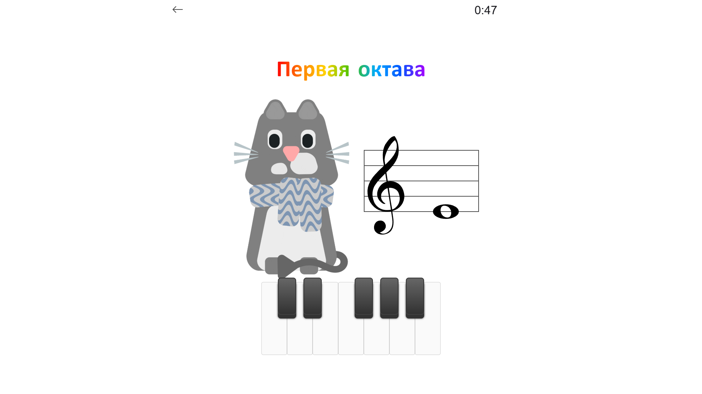
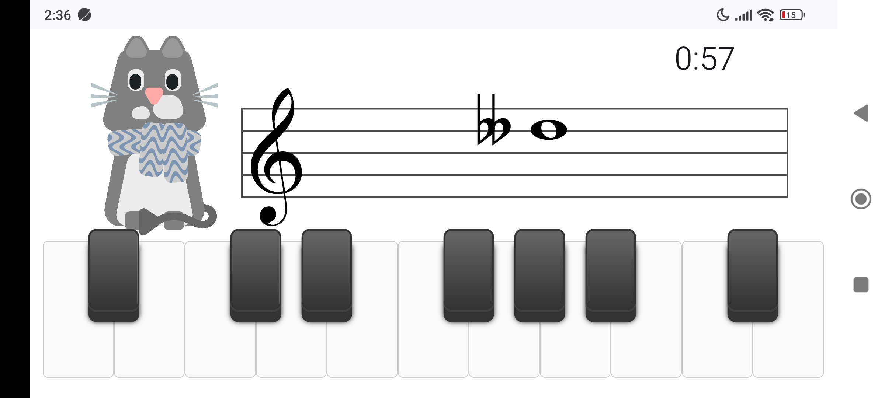
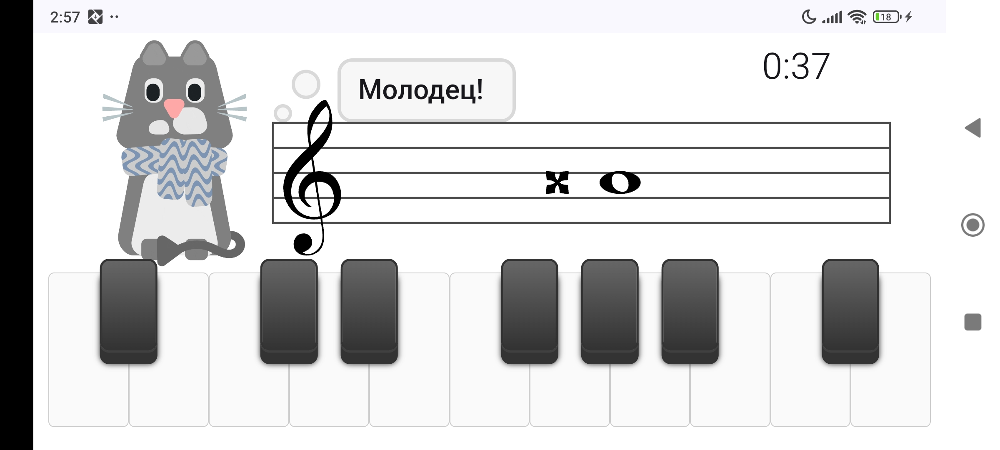
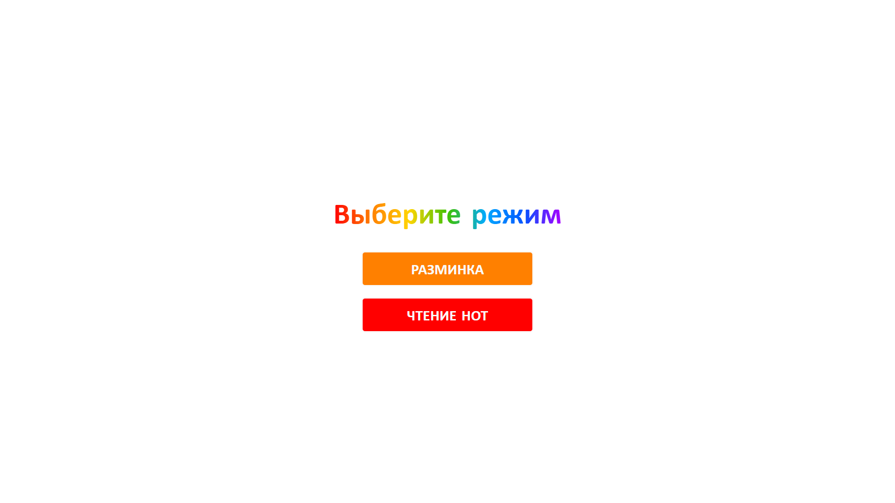
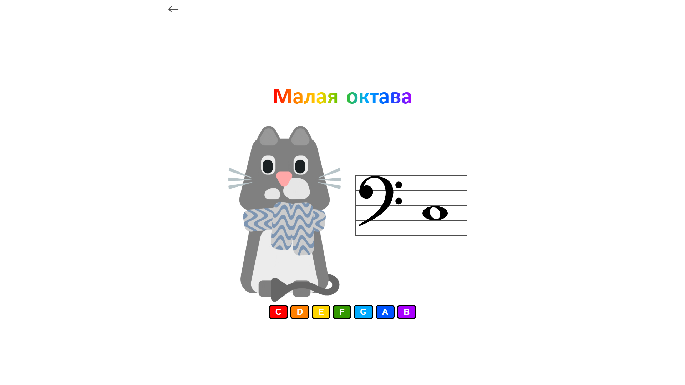

# Musicentric

A music app aimed at piano students to improve their sight-reading ability.
Note: the app interface is in Russian since it was made for a local tutor and their students.
The code works as intended, though some parts may be hard to read and not fully refactored.

# Features
- Four octaves (Small, Great, One-line, Two-line)
- Rich mode choice: sharps, flats, sharps and flats, double-sharps and double-flats, white keys, colored buttons instead of keys (for kids who don't know piano keyboard yet and don't know how to read)
- Animated mascot

At the moment, the mascot only contains a blinking animation, but I'm planning to extend it further by adding other animations that get triggered at different times: for instance, when the user makes a mistake or chooses the correct note.
I'm also planning to make the mascot emit sounds.
The sprite and animation for the mascot were made by me.
# Demo
[Link to the app](https://andreymarikov.github.io/musicentric/)
# Screenshots

